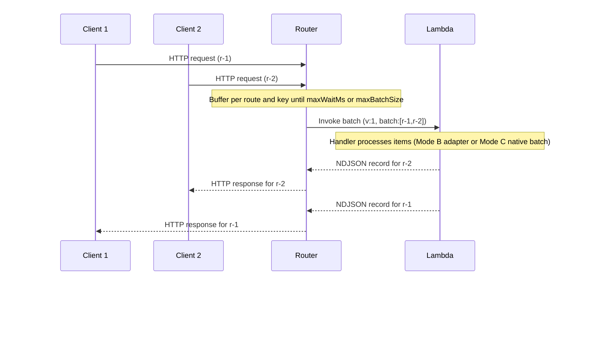

# Architecture

## System boundary

Lambda Parallel Router is a long-running HTTP service. It accepts requests, batches them per route, and invokes Lambda once per batch.

## Data flow

1. The router receives an HTTP request and matches a route in the compiled spec.
2. The router buffers requests for up to `maxWaitMs` or until `maxBatchSize`.
3. The router invokes Lambda with a batch payload.
4. Lambda returns per-request responses in buffered or streaming form.
5. The router demultiplexes responses and returns them to clients.

## Sequence diagram

This diagram shows two client requests multiplexed into one Lambda invocation and demultiplexed back into per-request responses. It illustrates NDJSON streaming with early return.



Buffered mode returns one JSON document with `responses[]`. The router responds after the full batch completes.

## Batch contract

The router sends a JSON payload with a version marker, metadata, and a batch array. Each batch item follows the API Gateway HTTP API v2 event shape.

```json
{
  "v": 1,
  "meta": {
    "router": "lambda-parallel-router",
    "route": "/hello/{id}",
    "receivedAtMs": 1730000000000
  },
  "batch": [
    {
      "routeKey": "GET /hello/{id}",
      "requestContext": {
        "requestId": "r-1",
        "routeKey": "GET /hello/{id}",
        "http": { "method": "GET", "path": "/hello/1" }
      },
      "rawPath": "/hello/1",
      "headers": { "accept": "application/json" },
      "queryStringParameters": { "max-delay": "0" },
      "pathParameters": { "id": "1" },
      "body": "",
      "isBase64Encoded": false
    }
  ]
}
```

The `v` field is the protocol version. Mode A requires `v: 1` to detect LPR batches. The router always includes `v: 1`.

Batch request requirements:

- `v` is required and must be `1`.
- `meta.route` is required and matches the compiled route template.
- Each batch item must include `routeKey`, `requestContext.requestId`, `requestContext.http.method`, and `rawPath`.
- The router uses `requestContext.requestId` as the response `id`.

## Response contracts

Buffered and standard NDJSON response records must include `id` and `statusCode`. Records with unknown `id` values are dropped.
Response records may include a `cookies` array. The router maps these to `Set-Cookie` headers.

### Buffered response

```json
{
  "v": 1,
  "responses": [
    {
      "id": "r-1",
      "statusCode": 200,
      "headers": { "content-type": "application/json" },
      "body": "{\"ok\":true}",
      "isBase64Encoded": false
    }
  ]
}
```

Buffered responses can return in any order. The router waits for a response per buffered request or times out the batch.

### Streaming response (NDJSON)

```json
{"v":1,"id":"r-1","statusCode":200,"headers":{"content-type":"application/json"},"body":"{\"ok\":true}","isBase64Encoded":false}
```

Each line is a complete response record. Records arrive in completion order.

Streaming response constraints:

- The router does not reorder stream records.
- Missing `id` values cause the record to be dropped.

### Interleaved streaming (experimental)

Interleaved streaming uses NDJSON records with `head`, `chunk`, and `end` events. The router demultiplexes these into per-request streams.

```json
{"v":1,"id":"r-1","type":"head","statusCode":200,"headers":{"content-type":"text/event-stream"}}
{"v":1,"id":"r-1","type":"chunk","body":"data: hello\n\n","isBase64Encoded":false}
{"v":1,"id":"r-1","type":"end"}
```

This format is experimental and intended for advanced streaming use cases.
See [docs/interleaved-streaming.md](interleaved-streaming.md) for the framing rules.

Interleaved streaming constraints:

- `head` is optional. If it is omitted, the router synthesizes a default `head` (200, empty headers)
  when it receives the first `chunk` or `end` for that id.
- The router closes the stream on the first `end` for a given id.

## Batching behavior

- Batching is per route and per batch key.
- The batch key includes the target Lambda, method, and route template.
- Additional key dimensions can be set with `x-lpr.key` to prevent unsafe co-batching.
- `dynamicWait` adjusts the wait window based on observed request rate.

## Timing and splitting

- The router starts the `maxWaitMs` timer when the first request arrives for a batch key.
- When `maxBatchSize` is reached, the router invokes Lambda immediately.
- When the payload exceeds `MaxInvokePayloadBytes`, the router splits the batch at request boundaries.

## Payload limits

`MaxInvokePayloadBytes` defaults to 6 MiB (6 * 1024 * 1024 bytes). Oversized batches are split when possible. A single request that exceeds the limit fails and returns a 502.

## Non-goals

- Cross-route batching.
- Byte-level multiplexed streaming across requests.
- Full API Gateway feature parity.
- Automatic deduplication or caching.
- WebSocket or bidirectional protocols.
- Automatic request retries.
